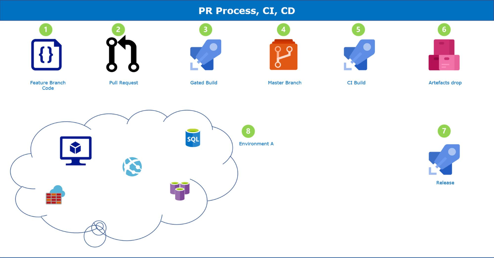

# Madikonda Jagadish -Sand Glass - JDBC - JDBC with Sqlite Console App

## Date Time: 26-Mar-2023 at 09:00 AM IST

## Java Training acquired

> 1. JAVA SWING: Subtle understanding of Swing components and functionalities and their role in creating customized and complex applications. Worked on basic applications such as Calculator, Basic sEmployee Management System etc., the inclusion of JDBC and OOPS concepts that makes it more custom-oriented and user interactive.

> 2. JAVA FX: Basic overview and brief understanding of JAVA FX and its use cases that can be implemented for creating applications. Worked on simple applications such as Calculator,Login Forms and To-do App where we can track attendance and add new employees and explored various components involved that make the portrayal of the application rich and interactive.

> 3. JAVA: Good understanding of OOPS concepts and JDBC.Currently, at a beginner’s level, but constantly working to build and sharpen my skills that can contribute to overall growth.

## Pull Request process, Continues Integration and Continues Delivery

