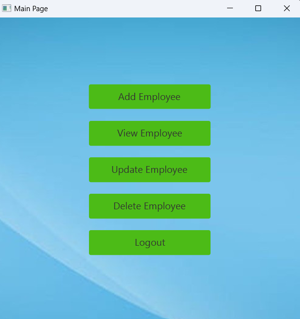
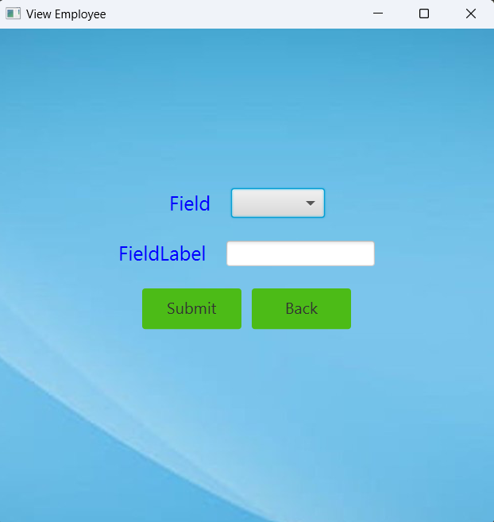

# Madikonda Jagadish

## Date Time: 20-Mar-2023 at 05:00 AM IST

## Java Training acquired

> 1. **JAVA SWING**: Subtle understanding of Swing components and functionalities and their role in creating customized and complex applications. Worked on basic applications such as Calculator, Basic sEmployee Management System etc., the inclusion of JDBC and OOPS concepts that makes it more custom-oriented and user interactive.

> 2. **JAVAFX**: Basic overview and brief understanding of JAVA FX and its use cases that can be implemented for creating applications. Worked on simple applications such as Calculator,Login Forms and To-do App where we can track attendance and add new employees and explored various components involved that make the portrayal of the application rich and interactive.

> 3. **JAVA**: Good understanding of OOPS concepts and JDBC.Currently, at a beginner’s level, but constantly working to build and sharpen my skills that can contribute to overall growth.

### Pull Request process, Continues Integration and Continues Delivery

**References**:

> 1. https://learn.microsoft.com/en-us/azure/devops/repos/git/about-pull-requests?view=azure-devops
> 2. https://learn.microsoft.com/en-us/azure/architecture/example-scenario/apps/devops-dotnet-baseline

##  Employee Data Management using JavaFX

This is a JavaFX application for managing the employee data

It has the following functionalities:

  >1. **Admin Login**: Allows the admin to login into the system.
  >2. **Add Employee**: Allows you to add a new employee into the system by taking personal and professional details
  >3. **View Employee**: Allows you to view the data of the employee based on their respective fields like name, employeeId, email.
  >4. **Delete Employee**: Allows you to delete the data of an employee based on their employeeId

## Classes:
 This application consists of the following classes

 >1. **Login and ForgetPassword classes**: These classes are responsible for the login into the system and to know the password if the user forgot it. 
 >2. **Main class**: This class is reponsible for selecting the various operation to be done in this application.
 >3. **DeleteEmployee**: This class is to delete an employee data from the database.
 >4. **ViewEmployee**: This class is responsible to view the employee data.
 >5. **AddEmployee**: This class is responsible for adding an employee information into the database.

## Prerequisites

**MySQL Database**: This application uses MySQL database for storing the employee data. Create a database named employeeDetails for storing the employee information and Admin for storing the admin credentials. The db_admin.sql contains the sql query used to create the admin table for login and db_employeeDetails.sql contains the sql query used to create the employeeDetails table for storing the employee details. 

## Installation

 >1. Clone the repository to your local machine.
 >2. Open the project in your Java IDE(e.g. Eclipse, IntelliJ IDEA, NetBeans).
 >3. Build and run the Login.java file.
 >4. The application opens the login window. Login with the correct credentails and follow the prompt for add, view, delete employees.

## Usage

### This application is designed to manage the employee details

 >1. Login in with the correct credentails and add the employee details by using add employee page.
 >2. You can retrive the data of an employee based on the mentioned fields using the view employee page.
 >3. You can delete the data of an employee based on the employee id using the delete employee page.  
 >4. By using the forget password link one know the password associated with respective userid

## Login Page 

 >1. This page verifies the user credentails and if they are correct then it will allow for the Home page.
 >2. If the credentials are wrong, it will display a warning as details are incorrect.

## Home Page

## Add an Employee

## View Employee

## Employee Data

## Delete Employee

## Code Description
 
 >1. Create the pages which extend Application and override start method
 (https://github.com/mjr912/mj-mar-2023-demo/blob/main/EmployeeDataManagement/src/main/java/com/example/employeeregistration/LoginPage.java)
 >2. Create a controller class for the employee details class which is used to evaluate the actions performed and create a table which will initialize the table in the initialize method and create a method connection for retriving the data from database and add to table.
 (https://github.com/mjr912/mj-mar-2023-demo/blob/main/EmployeeRegistration/src/main/java/com/example/employeeregistration/EmployeeDetailsController.java)
 >3. Create the database class for connecting to the database.
 (https://github.com/mjr912/mj-mar-2023-demo/blob/main/EmployeeRegistration/src/main/java/com/example/employeeregistration/DatabaseConnection.java)